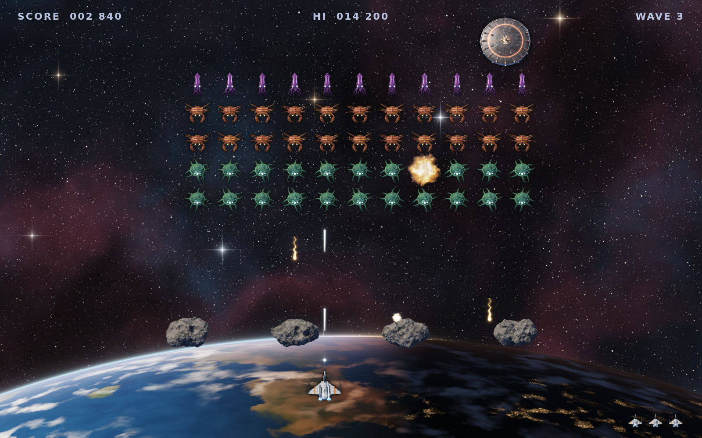

# Games

## Glassfall

A browser falling-block puzzle that mixes Tetris line clears with Puyo Puyo
colour chains, styled after Aqua-era Mac OS X, Frutiger Aero and Liquid Glass.

Open `glassfall/index.html` in a browser. There is no build step and nothing
to install.

- Design notes and open questions: [`glassfall/DESIGN.md`](glassfall/DESIGN.md)
- Rules tests: `node glassfall/tests/rules.test.js`
- Status: **checkpoint 2**, the playable core (keyboard and touch).

## Armada

A Space Invaders-style shooter with realistic, raymarched 3D art baked to
sprites.

- Design notes, asset list and how to rebuild the art: [`armada/DESIGN.md`](armada/DESIGN.md)
- Status: **checkpoint 1**, core art and a static scene mockup (not playable yet).

