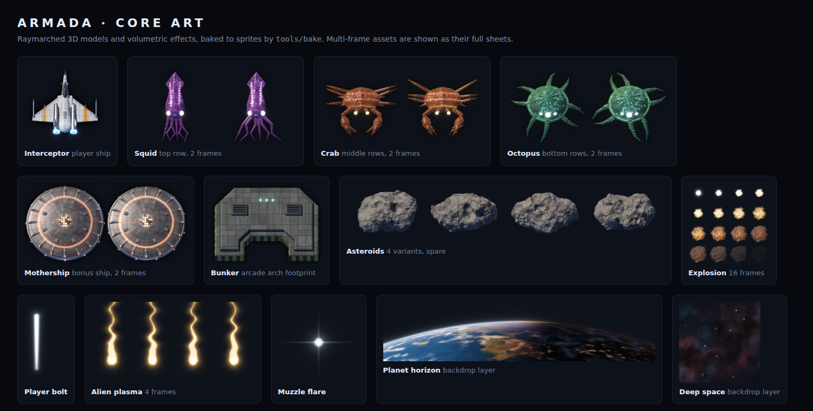

# Armada — design notes

A remaster of **Space Invaders** (Taito, 1978) with realistic, rendered
graphics: an alien armada descends on a planet and you hold the orbit line in
a lone interceptor.


Open `index.html` in a browser. There is no build step and nothing to install.

## Status

**Checkpoint 2: playable prototype.** The full arcade loop works: waves,
bunkers, the mothership, lives, extra ship, game over and a stored high score,
with keyboard and touch controls and synthesised sound.

Checkpoint 1 was the core art, reviewed before the prototype was built.
Decisions from that review:

- **Shields:** the arcade's arch-shaped bunkers, as the more faithful choice
  (they replace the asteroids from checkpoint 1).
- **Layout:** landscape, as in the mockup. Portrait works, but the playfield
  is small; revisit later.
- **Look:** the realism could go further. Keep the current art for the
  prototype and revisit it after playtesting.
- **Player ship:** it needs more work, but not at this stage.

## Rules (faithful to the arcade)

| Rule | Arcade behaviour kept |
|---|---|
| Rack | 11 × 5: squid (30), 2 rows of crabs (20), 2 rows of octopi (10) |
| March | Invaders move **one at a time**, bottom-left first, one per 60 Hz frame. A pass through the rack takes as many frames as there are invaders, which is why the march speeds up as they thin out. A four-note bass loop plays once per pass. |
| Edges | When a pass ends with an invader at the edge, the next pass moves each invader down, then the rack reverses |
| Last invader | Moves 1.5× as far per step when heading right |
| Hit freeze | The rack stops for 16 frames while a hit invader explodes |
| Player fire | One shot on screen at a time; shots can hit alien shots |
| Alien fire | Three shot types (rolling, plunger, squiggly), at most one of each on screen. Rolling shots are aimed at the column above you; plunger and squiggly shots use the arcade's column tables. The reload time gets shorter as your score rises (48, 16, 11, 8, 7 frames at 0, 200, 1000, 2000, 3000 points). Shots speed up when 8 or fewer invaders remain. |
| Mothership | Every 1536 frames (25.6 s) while at least 8 invaders remain. Its value comes from the arcade's table indexed by your shot count, so the 23rd shot, and every 15th after it, scores 300. |
| Bunkers | Four arch-shaped bunkers are eroded by every hit, from above and below. Invaders plough through them. They are rebuilt each wave. |
| Waves | Each new wave starts lower: 0, 2, 3, 4, 4, 4, 5, 5, 5 drops |
| Lives | 3 ships, plus 1 extra at 1500 points. Everything freezes while your ship explodes. The game ends at once if invaders reach the bottom. |

The playfield is 1600 × 1000 world units, scaled to fit the window.
Distances are scaled from the arcade's 224 × 256 screen, so the rack travels
about as far, relative to its width, before each drop.

## Controls

| Action | Keyboard | Touch |
|---|---|---|
| Move | ← → (or A D) | Drag: the ship flies toward your finger |
| Fire | Space (or ↑ W Z X), hold to keep firing | Fires while your finger is down |
| Pause | P / Esc | Pause button |
| Sound on/off | M | — |

## Code

- `js/game.js`: rules and simulation (no DOM), fixed 60 Hz steps. Emits
  events (`kill`, `crater`, `march`, `ufo`, …) for the renderer and sound.
- `js/render.js`: draws the baked sprites and adds runtime effects:
  - tweened invader moves and a slight hover
  - engine plumes and banking on the player's ship
  - additive bolts and flares, sparks, multi-stage explosions and screen shake
  - bunker craters that are cut out of a per-bunker canvas and scorched
    around the edge
- `js/audio.js`: Web Audio synthesis for the march, laser, explosions,
  mothership siren and chimes. It starts on the first key or tap.
- `js/main.js`: loop, input, overlays and the high score (`localStorage`).
- `tests/rules.test.js`: headless rules tests (`node armada/tests/rules.test.js`).

Each bunker's collision mask is read from the sprite's alpha when the page is
served over HTTP. Opened from `file://`, the browser blocks reading those
pixels, so the game uses the matching analytic arch shape instead.

## Art



- **Rendered, not drawn.** Every ship and creature is a 3D model built from
  signed distance fields and raymarched with physically based shading (GGX
  specular, soft shadows, ambient occlusion, ACES tone mapping). Glowing parts
  get bloom. The results are baked to transparent PNG sprites.
- **One lighting rig for everything:** a warm key sun from the upper left
  (the same sun that lights the planet), a cool rim light, and blue bounce
  light from the planet below. The camera looks down with a slight tilt.
- **Invaders nod to the arcade's squid, crab and octopus**, as biomechanical
  creatures:
  - glossy chitin with a thin-film sheen and fine surface relief
  - glowing eyes, photophores, and light leaking from armour seams
  - two animation frames each, as in the original
- **Bunkers** are gunmetal armour whose footprint is the arcade arch: chamfered
  top corners and a notch underneath.
- **The backdrop** is kept dim so the sprites stand out. It shows a Milky Way
  band with faint nebulae, and a planet at dusk with city lights on its night
  side.

| File | Size | Frames | Use |
|---|---|---|---|
| `player.png` | 256² | 1 | Player interceptor |
| `invader-squid.png` | 256² × 2 | 2 | Top row |
| `invader-crab.png` | 256² × 2 | 2 | Middle rows |
| `invader-octopus.png` | 256² × 2 | 2 | Bottom rows |
| `mothership.png` | 320² × 2 | 2 | Bonus ship |
| `bunker.png` | 352×256 | 1 | Shields (also the collision mask) |
| `explosion.png` | 192² × 16 (4×4) | 16 | Kills and impacts |
| `bolt-player.png` | 48×160 | 1 | Player shot |
| `bolt-enemy.png` | 64×128 × 4 | 4 (loop) | Alien shots |
| `flare.png` | 128² | 1 | Muzzle and impact flare |
| `bg-space.jpg` | 2048² | 1 | Starfield (covers the screen) |
| `bg-planet.png` | 2048×448 | 1 | Planet horizon (sits on the bottom edge) |
| `asteroid.png` | 256×192 × 4 | 4 | Not used at the moment (kept for later) |

### Rebuilding the art

The art is generated from code in `tools/bake/`:

- `lib.js`: shared GLSL (noise, SDF primitives, panels, lighting rig)
- `gl.js`: WebGL2 harness (strip rendering, bloom, sheet packing)
- `assets-*.js`: one shader per asset
- `run.js`: drives headless Chromium and writes to `assets/`

```sh
NODE_PATH=$(npm root -g) node armada/tools/bake/run.js            # everything, about a minute
NODE_PATH=$(npm root -g) node armada/tools/bake/run.js bunker     # one asset
```

The output is deterministic. For review:

- `tools/preview.html?img=player,bunker&scale=1,0.5` shows assets on dark and
  checkerboard backgrounds.
- `tools/sheet.html` is the contact sheet.

## Next

- Playtest and tune the pacing (player speed, shot speeds, fire rates) in
  world units.
- Push the realism further (the review's first note), starting with the
  player ship.
- Ideas: distinct looks for the three alien shot types, a sound mix pass,
  gamepad support, and a portrait layout for phones.
